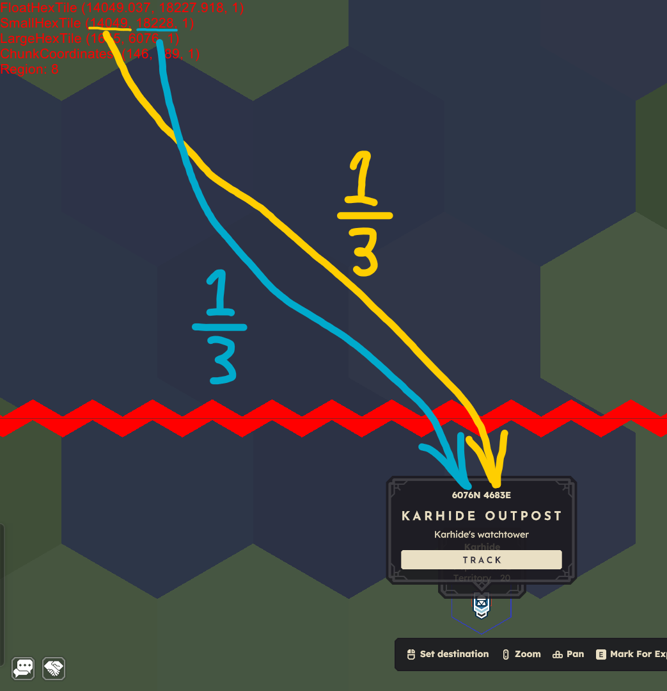

# やりたいこと

web上で国のテリトリーと戦争の状況を確認できるようにしたい

## BitJita APIについて

BASE URL `https://bitjita.com`

認証不要
json形式でレスポンスが返ってくる

**Rate Limit**

250リクエスト/分

**ヘッダー**

User-Agentかx-app-identifierでアプリケーション名を指定する必要がある。

例: BitJita (Map_With_Empire)

**全ての国を取得**
`/api/empires`

```json
{
  "empires": "array",
  "totalClaims": "number",
  "totalMembers": "number",
  "totalTreasury": "string",
  "count": "number"
}
```

"empires"の中身

```json
"empires": [
    {
      "entityId": "number",
      "capitalBuildingEntityId": "number",
      "name": "string",
      "shardTreasury": "number",
      "nobilityThreshold": "number",
      "numClaims": number,
      "locationX": number,
      "locationZ": number,
      "locationDimension": number,
      "createdAt": "datetime",
      "updatedAt": "datetime",
      "memberCount": "number",
      "leader": "string",
      "leaderEntityId": "number"
    },
]
```

国(EntityId)IDからウォッチタワーの情報を取得
`/api/empires/[id]/towers`

```json
[
  {
    "entityId": "string",
    "locationX": "number",
    "locationZ": "number",
    "locationDimension": "number",
    "energy": "number",
    "upkeep": "number",
    "active": "boolean",
    "nickname": "string",
    "siege": [
      {
        "active": "boolean",
        "energy": "number",
        "startTimestamp": "string",
        "empireEntityId": "number",
        "empireName": "string",
        "attacker": "boolean"
      }
    ]
  }
]
```

## ゲームの座標系について

### ゲーム内で確認できる座標

F4キーから確認できる座標。

```jsonc
FloatHexTile (12345.678, 87654.321, 1) //このゲームの基本座標、このプログラムでは使用しない
SmallHexTile (12345, 87654, 1) //これを内部座標と呼ぶ、FloatHexTileの小数点以下を切り捨てたもの
LargeHexTile (4115, 29218, 1) //SmallHexTileを1/3にしたものだがX座標だけかなりえぐい、このプログラムでは使用しない
ChunkCoordinates (128, 565, 1) //これをチャンク座標と呼ぶ、SmallHexTileを1/96にしたもの
Region: 1 //ゲーム内座標を縦3横3の9等分に分割し、原点から順に配置したもの、このプログラムでは使用しない
```

#### ゲーム内座標

Claimやウォッチタワーを右クリックしたときに、確認できる。
SmallHexTileを1/3にしたものをY座標(North)、X座標(East)の順で表記している。

`4415N 29218E` -> (Y座標, X座標)

#### 現状の内部座標の最大値

X: `23040`<br>
Y: `23040`

### 内部座標(F4で見れる)とゲーム内座標の変換

#### 内部座標

`SmallHexTile (12345, 54321, 1)` -> (X座標, Y座標, ディメンション)

#### ゲーム内座標

`18107N 4115E` -> (Y座標, X座標)

内部座標を1/3にしたものがゲーム内座標。ただしXとY座標を逆に書く。<br>
この場合`12345*1/3=4115`、`54321*1/3=18107`となる。



### 内部座標とチャンク座標の変換

#### 内部座標2

`SmallHexTile (12345, 54321, 1)` -> (X座標, Y座標, ディメンション)

#### チャンク座標

`ChunkCoordinates (128, 565, 1)` -> (Xチャンク座標, Yチャンク座標, ディメンション)

内部座標を`1/96`にしたものがチャンク座標。<br>
この場合`12345/96=128.59375`、`54321/96=565.84375`となり、小数点以下を切り捨てて`(128, 565)`となる。詳細は下記参照。

## 具体的な処理

### 情報取得

1. BitJitaのAPIから各帝国のウォッチタワーの位置情報を取得する。
2. 取得したウォッチタワーの位置情報は内部座標の形式で記述されている。

### 領地計算

1. 各ウォッチタワーの内部座標をチャンク座標に変換する。
   - 内部座標のXとYをそれぞれ96で割り、小数点以下を切り捨てる。
   - 例えば、内部座標が`(X, Y)`の場合、チャンク座標は`(⌊X/96⌋, ⌊Y/96⌋)`となる。
2. 各ウォッチタワーのチャンク座標を基に、そのウォッチタワーが占領する`5*5`チャンクの範囲を計算する。
   - 例えば、チャンク座標が`(CX, CY)`の場合、占領する範囲は`(CX-2, CY-2)`から`(CX+2, CY+2)`までとなる。

#### 例外処理

ウォッチタワーの内部座標がX,Yともに-1以下になることは無い想定だが、万が一のために`-1,-1`以下である場合は無視する。

また、ウォッチタワーの内部座標が0になることも無い想定だが、万が一のために`0,0`である場合は無視する。

また、ウォッチタワーの内部座標が最大値(23040)を超えることも無い想定だが、万が一のために`23040,23040`を超える場合は無視する。

### 説明

1つのチャンクは`96*96`である。

ウォッチタワーがは`5*5`のチャンクを領土として占領するため、`480*480`の領土を持つことになる。<br>
ウォッチタワーの座標から、それがどのチャンクにあるかを判定する必要がある。

例えば、内部座標`X1000, Y1000`にウォッチタワーがある場合、<br>
`X1000/96=10.41666...` → 10チャンク目<br>
`Y1000/96=10.41666...` → 10チャンク目<br>
つまり、`X10, Y10`のチャンクにウォッチタワーがあることになる。
そこから、占領するチャンクは`X8, Y8`から、`X12, Y12`までの範囲とわかる。

### 領地被りの処理

占領するチャンクを計算した後、他の国と領地が被っているかを確認する。<br>
被りがある場合、そのチャンクを競合としてマークし、あとで同じpolygonとして描画されないようにする。
これに優先順位は無く、被っている場合は全て競合として扱う。

### 戦争中の処理

さらに、ウォッチタワーが戦争中かどうかを確認し、戦争中であればその情報を保持する。
戦争中の領地についてはその国の領土として保存するが、描画のタイミングで別途表記を加える。

同じタワーが複数の戦争をしている場合があるのか不明、なのであれば一旦エラーを吐かせるようにする。

### 非アクティブなタワーの処理

jsonのactiveがfalseのタワーは、領地を持たないものとして扱う。
この処理は領地計算の前に行う。

## 描画について

### 取捨選択

流石にウォッチタワーを全て描画させてしまうと重い。<br>
タワーに伴う領地のみを描画するようにする。

### 描画ルール

#### 領地色

BitJita APIに領地色の情報が無い。
ゲーム内でDBに接続して取得、何かしらリストに保存して、変更があればつど更新していくしかないか。
領地色の情報を別途用意し、国名と紐づけて管理することになりそう。

#### 領地の描画

geojsonのpolygonで描画する。
領地が長方形でない場合でも、単一のpolygonで描画する。穴あき領地も同様。

#### 領地の被り

灰色で描画する。

#### 戦争中の領地

元の国の領地色で描画し、geojsonのPointを使用してpopupTextとiconで戦争中の国名を表示する。
一旦popupTextだけで実装し、後でアイコンも追加するか検討する。

### パフォーマンス

一旦生成してみないと分からん。
もし重いようなら、Region毎に分割しGistを分けて出力する。

## 更新頻度

### Gist全体の更新頻度

Actionを手動で実行するのみ。

### タワー情報取得の頻度

APIのRate Limitは1分間で250回までなので、それに引っかからない程度。

## 出力について

### 出力先と形式

Gistにgeojson形式で出力する。
詳しくは生成後に良い感じにする。
更新については、既存のGistを上書きする形で行う。

### 閲覧方法

URL [https://bitcraftmap.com/]

ここにqueryパラメータでgeojsonのGistのIDを指定することで閲覧できる。

`?gistId=GIST_ID`

外部サイトだよりではあるが、こちらの方が実装が簡単か？
